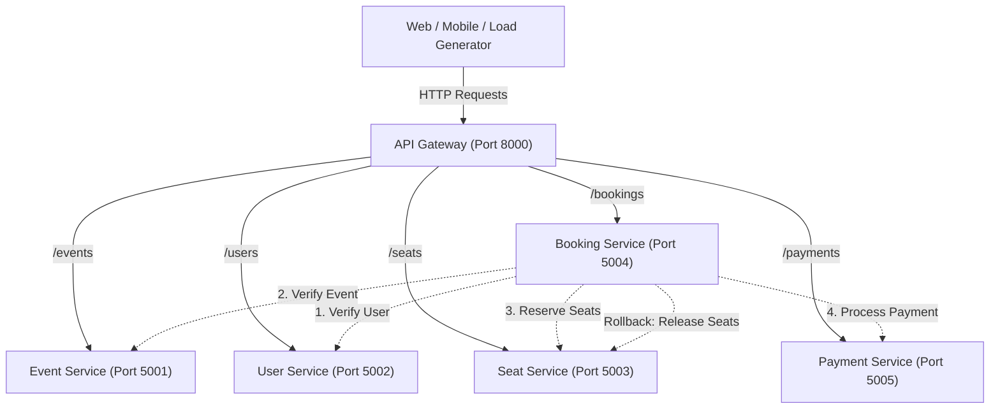
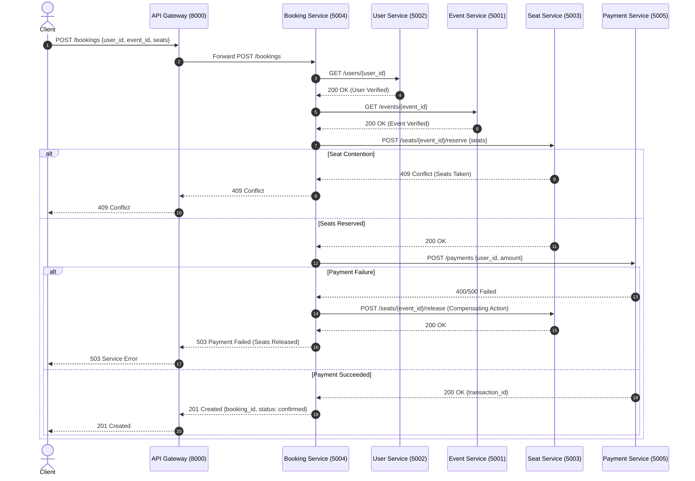

# System Architecture & Design Document

**Project:** Movie & Concert Ticket Booking Platform  
**Course:** Cloud Computing Laboratory (CCLab)  
**Institution:** KLE Technological University  

---

## 1. High-Level Architecture

The system implements a domain-driven microservices architecture where client interactions pass through a single entry point—the **API Gateway**. Downstream services communicate synchronously via REST/HTTP over an isolated Docker bridge network.

---

## 2. Microservice Domains & Port Allocation

| Component | Host Port | Container Port | Domain Responsibility |
| :--- | :---: | :---: | :--- |
| **API Gateway** | `8000` | `8000` | Reverse proxy, request forwarding, CORS, aggregated health checks |
| **Event Service** | `5001` | `5000` | Movie and concert catalog, venues, event dates |
| **User Service** | `5002` | `5000` | User account registrations and profile management |
| **Seat Service** | `5003` | `5000` | Seat inventory, real-time availability, reservation locks, seat releases |
| **Booking Service**| `5004` | `5000` | Orchestrates distributed booking transaction workflow |
| **Payment Service**| `5005` | `5000` | Transaction processing, payment validation, and receipt generation |

---

## 3. Distributed Booking Workflow & Compensation Pattern (Saga)

The **Booking Service** functions as an orchestrator implementing a lightweight Saga pattern with compensating actions to guarantee data consistency across microservices:

---

## 4. Container Networking & Service Discovery

All microservices run in isolated containers attached to `microservices-network` (Docker bridge network). Inter-service communication relies on Docker's embedded DNS server, allowing services to resolve upstream dependencies by container name:
- `http://event-service-container:5000`
- `http://user-service-container:5000`
- `http://seat-service-container:5000`
- `http://booking-service-container:5000`
- `http://payment-service-container:5000`
