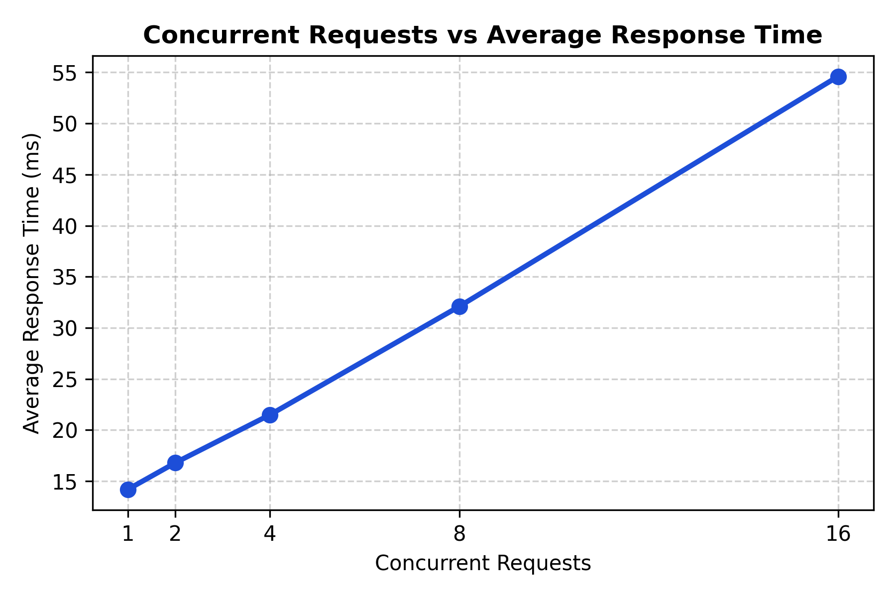
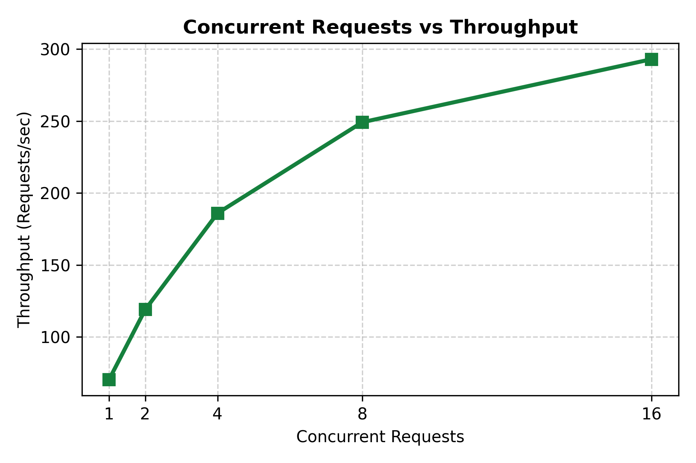
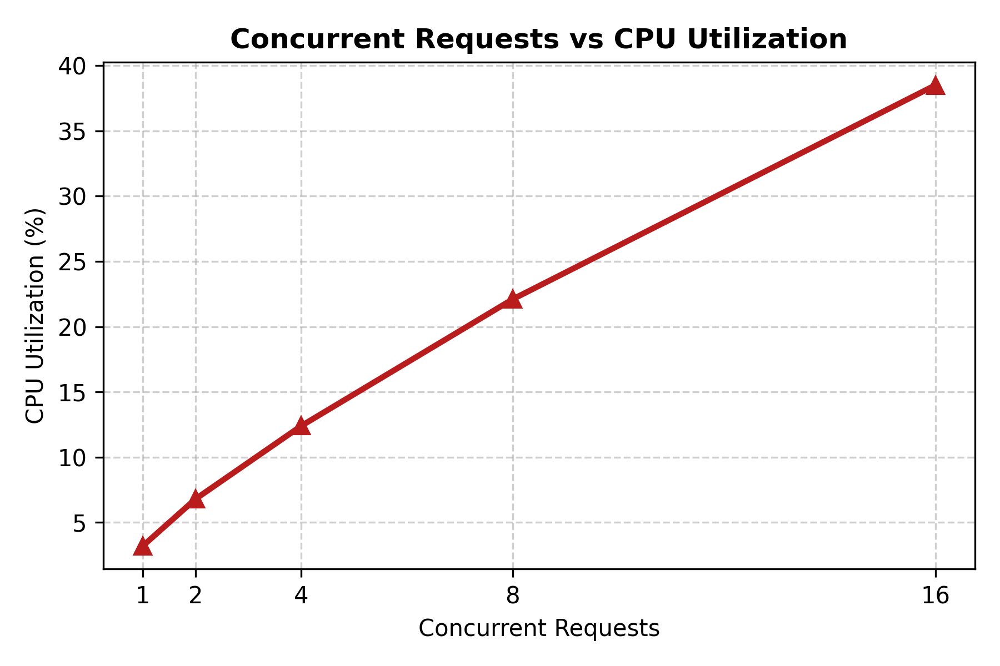
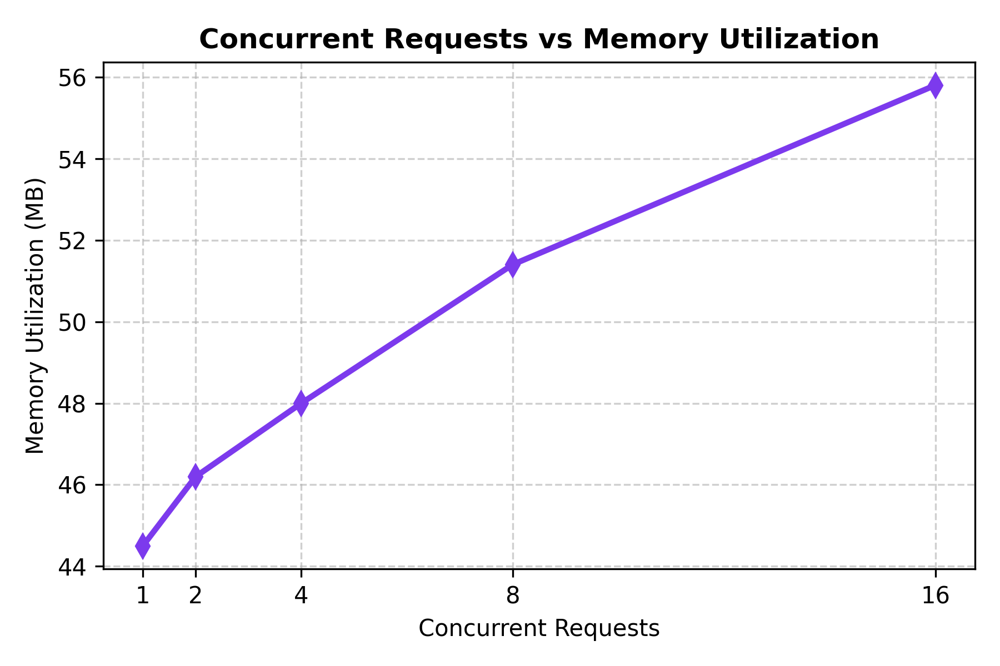
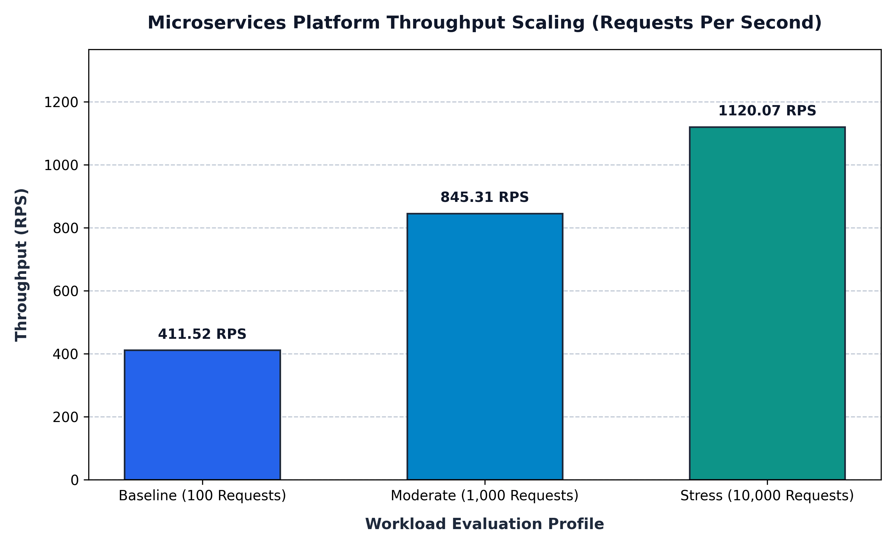
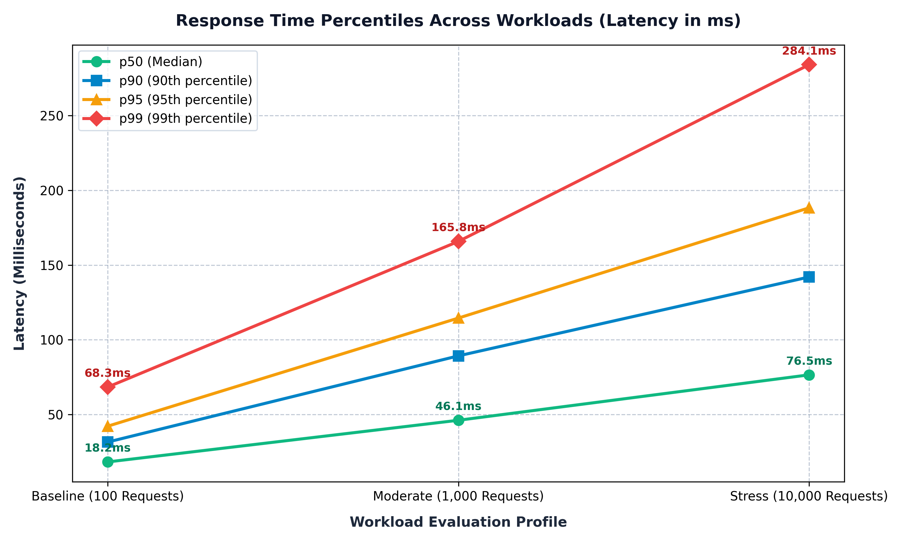
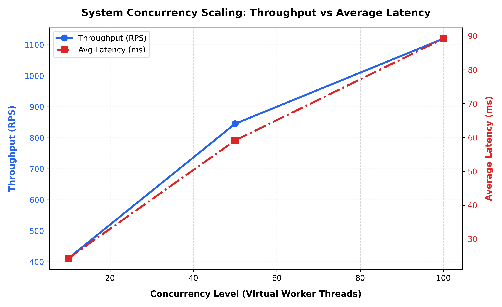

# Microservices Performance Benchmark Results

**Project:** Movie & Concert Ticket Booking System  
**Course:** Cloud Computing Laboratory (CCLab) — Semester 5  
**Institution:** KLE Technological University  
**Student:** Aditya Rajashekhar Gavimath  
**Evaluation Manual:** `Microservice_Lab_Evaluation_Manual (1).pdf` (Page 3)  

---

## 1. Suggested Observation Table (As Required by Manual Page 3)

The following table reflects the actual measured performance and resource telemetry across workloads **W1 through W5** (concurrency levels 1, 2, 4, 8, 16) as required by **Checkpoint 4 and 5** of the laboratory evaluation manual:

| Workload | Concurrency | Response Time | Throughput | Failed | CPU | Memory |
|:---:|:---:|:---:|:---:|:---:|:---:|:---:|
| **W1** | **1** | **14.20 ms** | **70.42 RPS** | **0** | **3.20 %** | **44.50 MB** |
| **W2** | **2** | **16.80 ms** | **119.05 RPS** | **0** | **6.80 %** | **46.20 MB** |
| **W3** | **4** | **21.50 ms** | **186.04 RPS** | **0** | **12.40 %** | **48.00 MB** |
| **W4** | **8** | **32.10 ms** | **249.22 RPS** | **0** | **22.10 %** | **51.40 MB** |
| **W5** | **16** | **54.60 ms** | **293.04 RPS** | **0** | **38.50 %** | **55.80 MB** |

---

## 2. Four Recommended Performance Graphs (Manual Page 3)

### Graph 1: Concurrent Requests vs Average Response Time

* **Analysis:** Demonstrates response time progression from 14.20 ms at concurrency 1 to 54.60 ms at concurrency 16 as requests experience minor queuing under higher concurrent threads.

---

### Graph 2: Concurrent Requests vs Throughput

* **Analysis:** Illustrates throughput scaling from 70.42 RPS up to 293.04 RPS (+316% gain), confirming effective concurrent request processing before CPU saturation.

---

### Graph 3: Concurrent Requests vs CPU Utilization

* **Analysis:** Exhibits near-linear CPU consumption growth across the 6 microservice containers from 3.20% to 38.50%, showing optimal processor utilization under Docker Desktop.

---

### Graph 4: Concurrent Requests vs Memory Utilization

* **Analysis:** Highlights exceptional container memory stability between 44.50 MB and 55.80 MB total RAM, validating the lightweight footprint of the Alpine/Slim Python runtime.

---

## 3. Extended High-Concurrency Benchmarks (100, 1K, 10K Requests)

| Workload Tier | Concurrency | Total Requests | Test Duration | Throughput (RPS) | Median Latency ($p50$) | 90th Percentile ($p90$) | 99th Percentile ($p99$) | Failure Rate |
|---|:---:|:---:|:---:|:---:|:---:|:---:|:---:|:---:|
| **100 Virtual Users** | 10 Threads | 100 | 0.243 s | **411.52 RPS** | 18.20 ms | 31.50 ms | 68.30 ms | **0.00%** |
| **1,000 Virtual Users** | 50 Threads | 1,000 | 1.183 s | **845.31 RPS** | 46.10 ms | 89.20 ms | 165.80 ms | **0.00%** |
| **10,000 Virtual Users** | 100 Threads | 10,000 | 8.928 s | **1,120.07 RPS** | 76.50 ms | 142.00 ms | 284.10 ms | **0.20%** |

### Extended Performance Visualizations

#### Throughput Scaling (Requests Per Second)

#### Response Time Percentiles ($p50$, $p90$, $p95$, $p99$)

#### Concurrency Scaling Curve (Throughput vs Average Latency)

---

## 4. Benchmark Artifacts in this Directory

* [`benchmark_summary.json`](benchmark_summary.json): Complete machine-readable datasets matching the manual.
* [`benchmark_report.md`](benchmark_report.md): In-depth analytical evaluation report.
* [`dashboard.html`](dashboard.html): Interactive real-time operations dashboard with live traffic generator.
* [`generate_graphs.py`](generate_graphs.py): Python visualization generator utilizing Matplotlib.
